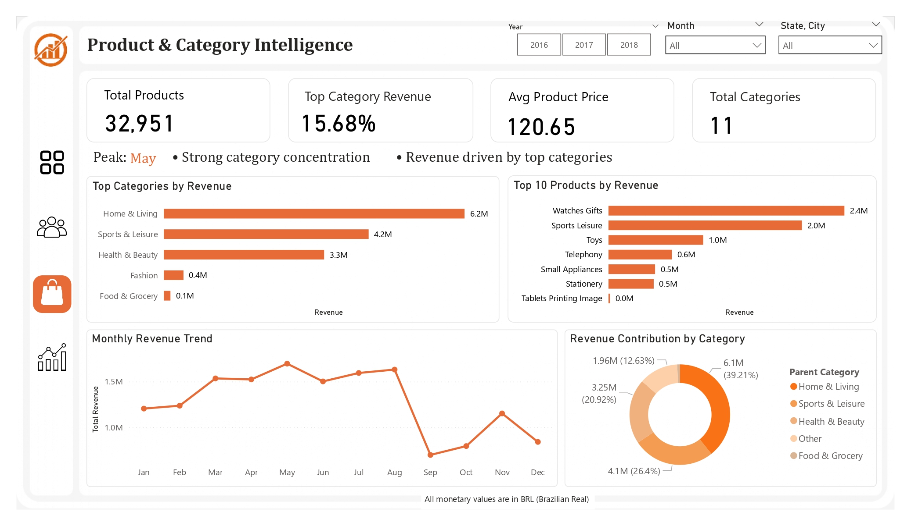

# 📊 Marketplace Intelligence Dashboard (Power BI)

🔗 **Live Dashboard:**  
https://app.powerbi.com/view?r=eyJrIjoiMGViY2Y5NDktMjNiYi00MGM0LThjMDEtNzYwYjQyYzkyNTE3IiwidCI6ImQ0MzBkNGE4LThhNDctNDI2OC1iMjk2LTUxMDRlNmY2MmUwZSJ9

---

## 📌 Overview
This project presents a comprehensive **Marketplace Intelligence Dashboard** built using Power BI to analyze revenue performance, customer behavior, and demand patterns within an e-commerce dataset.  

The solution follows an **end-to-end analytics pipeline**, from raw data processing to business intelligence, enabling structured and actionable decision-making.

---

## 🎯 Objectives
- Analyze overall revenue performance and trends  
- Segment customers using **RFM (Recency, Frequency, Monetary) analysis**  
- Identify high-performing products and categories  
- Understand demand patterns and behavioral shifts over time  

---

## 🧠 Dashboard Structure

### 1️⃣ Executive Overview
- Key KPIs: Revenue, Orders, Customers, Average Order Value  
- Monthly performance trends  
- High-level business summary  

---

### 2️⃣ Customer Intelligence (RFM Segmentation)
- Segmentation into: Champions, Loyal, Potential Loyalists, At Risk, Lost  
- Customer distribution and value contribution  
- Identification of retention and growth opportunities  

---

### 3️⃣ Product & Category Intelligence
- Top-performing products and categories  
- Revenue contribution by category  
- Concentration of revenue across segments  

---

### 4️⃣ Demand & Behavioral Insights
- Orders vs Revenue relationship  
- Average Order Value (AOV) trends  
- Month-over-Month (MoM) growth analysis  
- Identification of peak and low demand periods  

---

## 📈 Key Insights
- Revenue peaks during mid-year, indicating seasonal demand patterns  
- A large portion of customers fall under **Potential Loyalists and Loyal segments**  
- **Champions generate the highest revenue per customer**, highlighting high-value users  
- Revenue is concentrated among a limited set of top-performing categories  
- Observable fluctuations in demand indicate **behavioral and seasonal shifts**  

---

## 🛠️ Tools & Technologies
- **Power BI** — Data modeling, DAX, and dashboarding  
- **SQL** — Data transformation and schema design  
- **Python (Pandas)** — Data preprocessing, RFM segmentation, cohort analysis  

---

## 📂 Dataset
- Brazilian E-Commerce Public Dataset (Olist)  
- https://www.kaggle.com/datasets/olistbr/brazilian-ecommerce  

*All monetary values are represented in BRL (Brazilian Real)*

---

## 📷 Dashboard Preview

### Executive Overview

### Customer Intelligence

### Product & Category Intelligence

### Demand & Behavioral Insights

---

## ⚙️ How to Use
1. Download the `.pbix` file from the repository  
2. Open using **Power BI Desktop**  
3. Explore insights using filters and interactive visuals  

---

## 📁 Project Structure
data/
notebooks/
sql/
data_outputs/
power_bi_dashboard/

---

## 💡 Key Takeaway
This project demonstrates the ability to build a **complete analytics solution**, combining data engineering, analytical modeling, and business intelligence to deliver actionable insights for decision-making.
