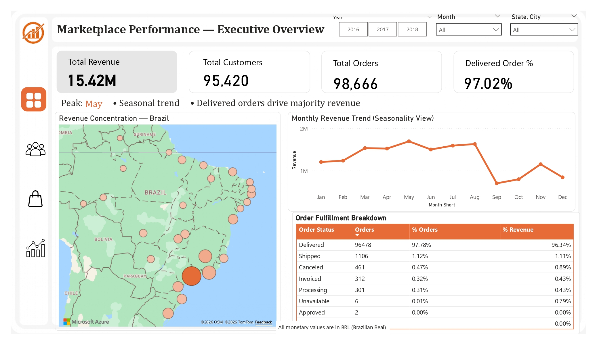
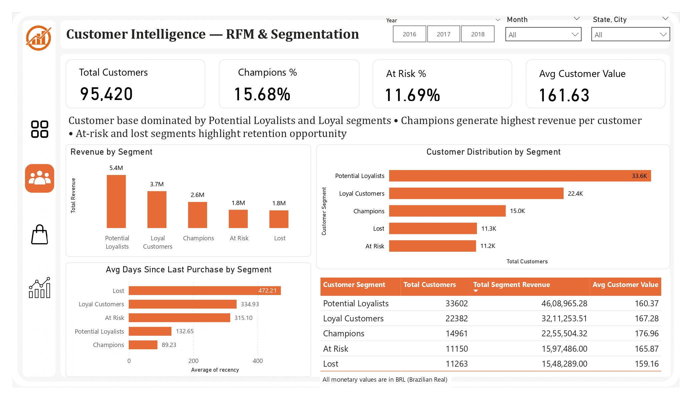
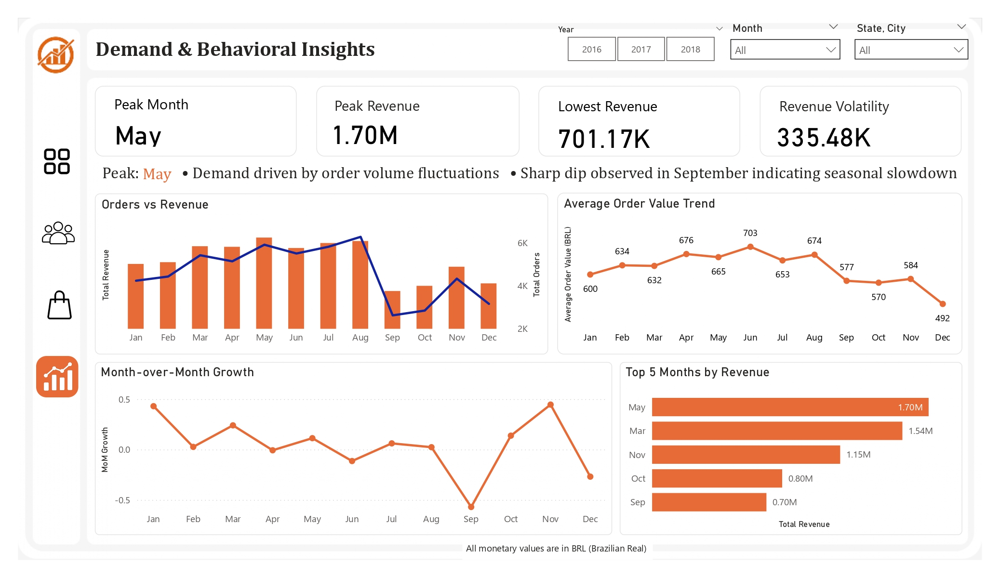

# 📊 Marketplace Intelligence Dashboard (Power BI)

🔗 **Live Dashboard:**  
https://app.powerbi.com/view?r=eyJrIjoiMGViY2Y5NDktMjNiYi00MGM0LThjMDEtNzYwYjQyYzkyNTE3IiwidCI6ImQ0MzBkNGE4LThhNDctNDI2OC1iMjk2LTUxMDRlNmY2MmUwZSJ9

---

## 📌 Overview
This project presents a comprehensive Marketplace Intelligence Dashboard built using Power BI to analyze revenue performance, customer behavior, and demand patterns in an e-commerce dataset.

It follows an end-to-end analytics workflow, from data processing to business intelligence, enabling structured and actionable decision-making.

---

## 🎯 Objectives
- Analyze revenue trends and performance  
- Segment customers using RFM (Recency, Frequency, Monetary)  
- Identify top products and categories  
- Understand demand patterns and behavioral shifts  

---

## 🧠 Dashboard Structure

### 1️⃣ Executive Overview
- KPIs: Revenue, Orders, Customers, AOV  
- Monthly revenue trends  

### 2️⃣ Customer Intelligence (RFM)
- Segments: Champions, Loyal, Potential Loyalists, At Risk, Lost  
- Segment contribution and distribution  

### 3️⃣ Product & Category Intelligence
- Top categories and products  
- Revenue concentration  

### 4️⃣ Demand & Behavioral Insights
- Orders vs Revenue  
- AOV trends  
- MoM growth  

---

## 📈 Key Insights
- Revenue peaks mid-year showing seasonality  
- Majority customers are Potential Loyalists and Loyal  
- Champions contribute highest value  
- Revenue concentrated in top categories  

---

## 🛠️ Tools & Technologies
- Power BI — Dashboarding, DAX  
- SQL — Data modeling  
- Python (Pandas) — RFM, cohort, analysis  

---

## 📂 Dataset
Brazilian E-Commerce Public Dataset (Olist)  
https://www.kaggle.com/datasets/olistbr/brazilian-ecommerce  

*All monetary values are in BRL (Brazilian Real)*

---

## 📷 Dashboard Preview

### Executive Overview

### Customer Intelligence

### Product & Category Intelligence

### Demand & Behavioral Insights

---

## ⚙️ How to Use
1. Download the `.pbix` file  
2. Open in Power BI Desktop  
3. Explore visuals and filters  

---

## 📁 Project Structure
data/
data_outputs/
notebooks/
sql/
power_bi_dashboard/

---

## 💡 Key Takeaway
End-to-end analytics project combining data processing, modeling, and visualization to generate actionable business insights.
